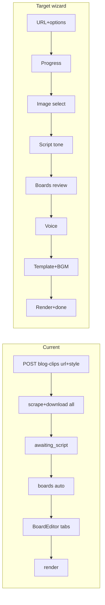

# Blog shorts wizard design (development spec)

**Status:** Design complete. **W1–W5 implemented** (wizard coding stages done).  
**Date:** 2026-07-15  
**Branch:** `sky_cut`  
**Related:** Stages 17–24 (existing pipeline), Stage 25 Remotion deferred (`REMOTION_EVAL.md`).

This document is the source of truth for implementing a SuperShorts-style
**step wizard** on top of New Cut’s blog-clip flow. Copy information
architecture and step order only — do not copy SuperShorts brand, blue theme,
or trademarked copy.

“Template” in reference screen 4 maps to **subtitle templates + audio
presets**, not Remotion layout packs.

---

## Asset mapping (today vs target)



| Reference screen | New Cut mapping | Already exists | Needs building |
|---|---|---|---|
| 1 Create options | create request fields | `style` only | `target_length`, `narration_language` |
| 2 Image select | pause after scrape | auto-download, 1:1 boards | `awaiting_images` + candidate APIs |
| 3 Voice / TTS | pre-render step | `/voices`, `tts_speed`, board `speaker` | wizard screen + default-voice API |
| 4 Template + BGM/SFX | pre-render step | subtitle templates, audio_assets | wizard UI + auto BGM/SFX rules |

**Reuse:**

- Frontend: `BlogClipFlow.tsx`, `CreateStudio.tsx`, `BoardEditor` / MediaPanel tabs
- Backend: `blog_service.py`, voices / templates / audio APIs

---

## Target UX (one project = one focused screen)

Keep creation out of the mixed workroom list: after create, stay on
`focusBlogClipId` flow with a side stepper.

```text
Workroom CreateStudio
  → [options] length · narration language · subtitle style
  → Create short
  → Progress: scrape + prepare image candidates
  → Image select: checked images only
  → Script tone: summary / hook / detailed (length biases prompts)
  → Boards review: summary or full BoardEditor → Next
  → Voice: AI voice gallery + speed (apply to all boards)
  → Style & audio: subtitle template cards / auto SFX / auto BGM / pick BGM
  → Create project (= POST .../render)
  → Render progress → completed screen
```

YouTube / MP4 sources stay on the existing video pipeline — **blog URL wizard
only**.

---

## Step 0 — Create-time options (reference 1)

**UI:** Options control next to the URL field → popover or expandable panel.

| Option | Values | Storage | Meaning |
|---|---|---|---|
| Video length | `short` \| `long` | `blog_clips.target_length` | short ≈ 10–20s (summary-biased); long ≈ 30–45s (detail-biased). Affects GPT candidate prompts only. No credits UI. |
| Narration language | `original` \| `ko` \| `en` \| `ja` | `blog_clips.narration_language` | Language for narration generation. `original` = match source (current GPT behavior). |
| Subtitle style | `basic` \| `bold` \| `shorts` | existing fields | Seeds system subtitle template |

**API:** extend `POST /blog-clips`:

```json
{
  "url": "...",
  "style": "shorts",
  "target_length": "short",
  "narration_language": "original"
}
```

**Backend:** pass length/language into `generate_blog_narration_script_candidates(...)`.  
Defaults: `short` + `original` for backward compatibility.

---

## Steps 1–2 — Extract images after URL, then select (reference 2)

### Phase 1 pipeline change

Today: scrape → download all → await tone.  
Target:

1. Scrape (title/text + image URLs)
2. Persist candidates on disk/DB (MVP: full download as today, **no boards yet**)
3. Stop at `status = awaiting_images`
4. User confirms selection → then script step

### Data

Preferred table `blog_clip_image_candidates`:

| Column | Notes |
|---|---|
| `id` | PK |
| `blog_clip_id` | FK |
| `order_index` | display order |
| `storage_path` | under `storage/blog/images/...` |
| `source_url` | original remote URL |
| `selected` | bool, default false |
| `created_at` / `updated_at` | |

(Prototype alternative: JSON columns on `blog_clips` — not preferred.)

### APIs

- `GET /blog-clips/{id}/images` — candidates + `selected` + preview hint
- `PUT /blog-clips/{id}/images/selection` — `{ "image_ids": [1,3,5] }`  
  Enforce `blog_image_min_count` … `blog_image_max_count`
- `GET /blog-clips/{id}/images/{image_id}/file` — auth image stream (same pattern as board images)

### Status

Add `awaiting_images` to `blog_clips.status` CHECK.

Order:

```text
pending → processing (scraping/downloading)
  → awaiting_images
  → awaiting_script
  → awaiting_boards
  → processing (render)
  → completed | failed
```

`select-script` allowed **only after** image selection is confirmed.  
`_generate_initial_boards` uses **selected images only**.

### UI

Selected grid on top · candidate filmstrip below · dashed add zone reserved for
later local upload · **Next**.

---

## Step 3 — Script tone (Stage 17, reordered)

After images confirmed: existing `awaiting_script` + `POST .../select-script`.  
`target_length` must influence candidate length guidance in the GPT prompt.  
Boards are generated from the selected image set.

---

## Step 4 — Boards review (Stages 18–20 entry)

While `awaiting_boards`:

- Compact summary (board count + thumbs) with **Next**, and/or
- Open full `BoardEditor` as “Edit details”; on close return to wizard Step 5

**Do not** put final render CTA on the boards step — move it to Step 6.

---

## Step 5 — Voice / TTS (reference 3)

**Server status:** remain `awaiting_boards` (client wizard step only).  
Persist via existing APIs (+ one convenience endpoint).

| UI | API |
|---|---|
| Mode: AI voice only for MVP (hide or disable “subtitles only” / “my voice”) | — |
| Voice gallery + samples | `GET /voices`, `GET /voices/{id}/sample` |
| Speed | `PATCH .../tts-settings` `{ "tts_speed" }` |
| Apply to all boards | per-board `speaker` PATCH, or convenience API below |

**Recommended new API:**

```http
PATCH /blog-clips/{id}/default-voice
{
  "voice_id": "alloy",
  "tts_speed": 1.0,
  "apply_to_all_boards": true
}
```

Optional column: `blog_clips.default_voice` as fallback when board `speaker` is null.

BoardEditor voice tab remains for advanced per-board edits.

---

## Step 6 — Template · auto SFX · BGM (reference 4)

**Server status:** `awaiting_boards`.  
No Remotion layout packs → use **subtitle template cards** as style choice.

| Control | Behavior | API / rule |
|---|---|---|
| Horizontal template scroller | system + user subtitle templates | list + `PATCH .../template` |
| Auto SFX ON/OFF | ON → place one system SFX at board transitions | `auto_sfx`; apply at render start |
| Auto BGM ON/OFF | ON → pick one system BGM | `auto_bgm`; map from `target_length` + `script_tone` |
| Pick BGM manually | existing picker | `PATCH .../audio-settings`; clears `auto_bgm` |
| Intro board | **Out of scope** | — |

**Final CTA:** “Create project” = existing `POST /blog-clips/{id}/render`.

**Schema:**

- `blog_clips.auto_bgm` (default false)
- `blog_clips.auto_sfx` (default false)
- optional `blog_clips.default_voice`

**Logic:** `audio_service.pick_default_bgm(tone, length)`, `pick_default_sfx()`;  
call from `start_blog_clip_render` or render pipeline entry.

---

## Status ↔ wizard UI matrix

| `status` / progress | Wizard UI step | Notes |
|---|---|---|
| pending / processing (phase 1) | Progress | existing |
| awaiting_images | Image select | **new** |
| awaiting_script | Script tone | existing, later in order |
| awaiting_boards + clientStep `boards` | Boards review | BoardEditor |
| awaiting_boards + clientStep `voice` | Voice | PATCH only |
| awaiting_boards + clientStep `style` | Template + BGM | PATCH + auto flags |
| processing (phase 2) | Render progress | existing |
| completed / failed | Result | existing flow result |

`clientStep` may live in React state. For refresh recovery, add optional
`blog_clips.wizard_step` TEXT.

---

## Implementation stages (when coding starts)

| Stage | Scope |
|---|---|
| **W1** | ✅ Create options: DB columns + POST body + prompts + CreateStudio options UI |
| **W2** | ✅ Image select: candidates table + `awaiting_images` + Flow UI + select-script gate |
| **W3** | ✅ Voice step in Flow: default-voice API + UI (keep BoardEditor voice tab) |
| **W4** | ✅ Style/audio step: `auto_bgm` / `auto_sfx` + UI + render wiring |
| **W5** | ✅ Polish: side stepper, reopen from workroom restores `wizard_step`, sync docs |

Update `PROJECT_STATUS.md`, `API_SPEC.md`, and `ARCHITECTURE.md` in each coding stage.

---

## Explicitly out of scope

- Remotion / layout video template packs (Stage 25 remains deferred)
- Credits / “1 credit” billing UI
- My-voice record/upload, subtitles-only mode
- Auto intro board
- Bulk local image upload into the candidate pool (later stage)
- Folding YouTube/MP4 into the same 7-step wizard

---

## Design done criteria

A developer can implement without re-litigating:

1. Which `status` values pause the pipeline  
2. Which APIs are new vs reused  
3. How reference screens 1–4 map to fields and UI  
4. Where the wizard stops and BoardEditor / voices / templates / audio take over
